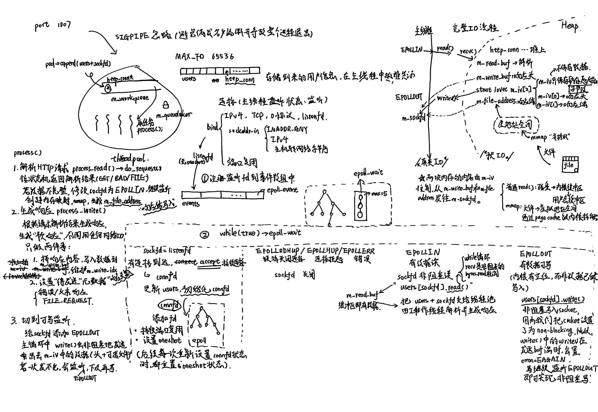
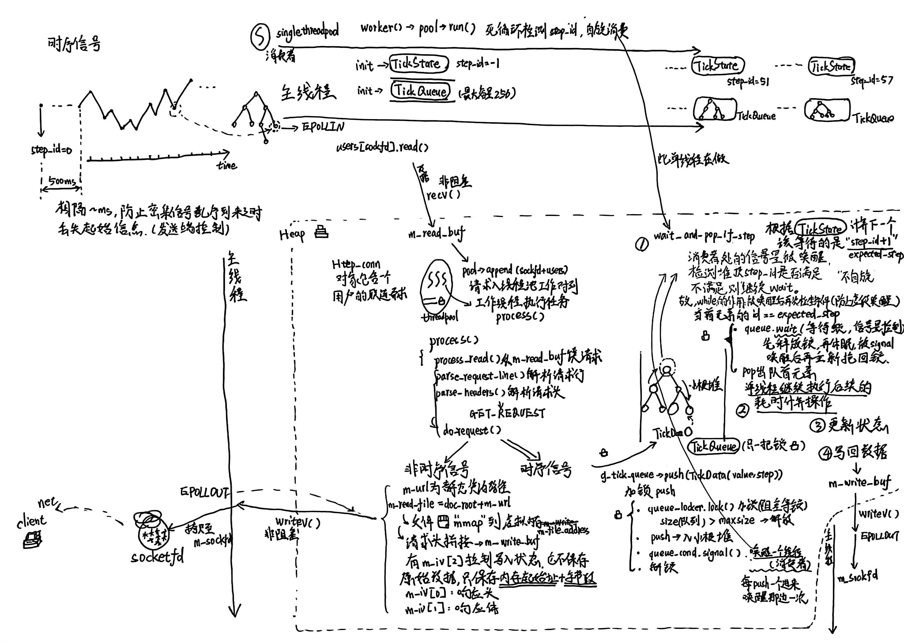
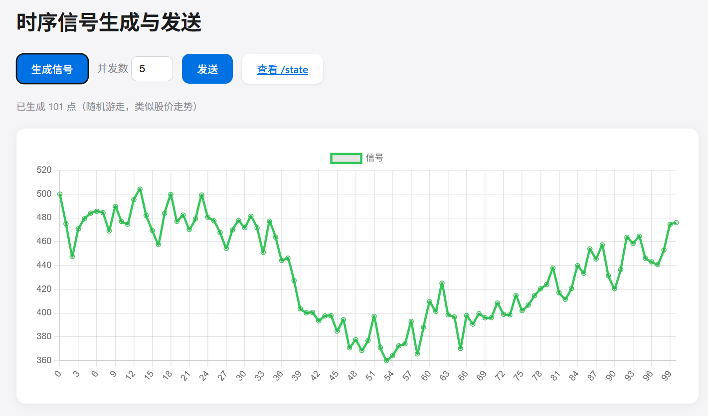
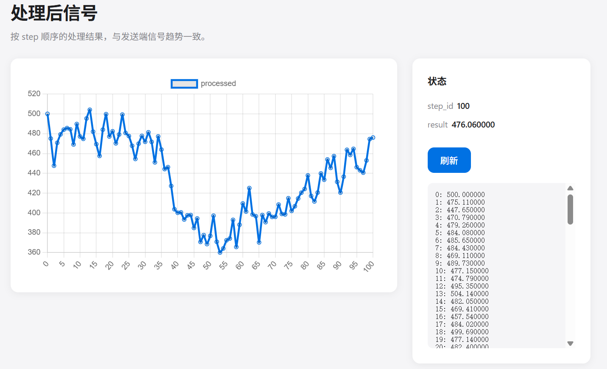

## TickFlow Server（高并发时序 Web 服务器）

基于 Linux `epoll` 的 Proactor 风格高并发 HTTP 服务器，配合线程池处理请求解析与响应组装；在此基础上集成了一套 **时序信号处理模块**（`TickQueue` / `TickState` / `singlethreadpool`），通过 HTTP 接口和前端页面，实现「多客户端乱序发送 → 服务端单线程按序处理 → 前后端可视化对比」的完整闭环。

> - **项目结构图**：
>   
>   
> - **前端演示图**：
>   
>     

---

## 功能总览

- **高并发 HTTP 服务器**
  - Proactor 模式：主线程负责所有 I/O（`accept` / `read` / `write`），工作线程只做解析和业务逻辑。
  - `epoll` + 非阻塞 I/O：ET（Edge-Triggered）+ `EPOLLONESHOT`，单 `epoll` 实例支撑大量并发连接。
  - 线程池（`threadpool<http_conn>`）：默认 8 个工作线程，可配置最大待处理请求数。
  - HTTP/1.1 GET 支持：主/从状态机解析请求行、头部、可选消息体，使用 `mmap + writev` 高效发送静态资源。

- **时序信号处理模块**
  - `TickQueue`：有界阻塞 **小根堆队列**（按 `step_id` 排序），多生产者 / 单消费者（MPSC）。
  - `TickState`：只被单消费者线程写，多线程可加锁读；按 `step_id` 严格递增更新共享状态。
  - `singlethreadpool`：内部 1 个工作线程，循环从 `TickQueue` 取出数据并调用回调（`on_tick`）处理。
  - 支持「**仅当堆顶 step 是下一步时才消费**」的等待策略：即使多客户端乱序发送，服务端也能严格按 `0,1,2,...` 顺序处理，不丢步。

- **HTTP 接口与前端可视化**
  - `/tick?step=&value=`：客户端提交一条时序数据（步序 + 数值），写入 `TickQueue`。
  - `/state`：返回当前 `step_id`、`result`，以及完整的「处理后信号」列表，同时在页面上用折线图展示。
  - `/tick.html`：单条发送页面，方便手动测试 /tick。
  - `/signal.html`：生成随机「股价风格」信号、配置并发数、乱序发送到 `/tick`，配合 `/state` 观察端到端行为。

---

## 架构概览

### HTTP 服务器（Proactor）

```text
                    main thread (epoll_wait)
                           |
        +------------------+------------------+
        |                  |                  |
   listenfd            EPOLLIN            EPOLLOUT
        |                  |                  |
     accept()            read()              write()
        |                  |                  |
   users[fd].init()   pool->append()    writev() 发响应
                            |
                     threadpool<http_conn>
                            |
                     http_conn::process()
                     (parse + process_write + modfd EPOLLOUT)
```

- **连接建立**：`listenfd` 就绪 → `accept` → `http_conn::init()`，把新 `connfd` 加入 `epoll` 监听。
- **读事件**：`EPOLLIN` → `http_conn::read()` 把数据读入 `m_read_buf` → `threadpool::append(users + sockfd)`。
- **工作线程**：执行 `http_conn::process()`，内部 `process_read()` 解析 HTTP，再根据结果准备响应（`process_write()`），最后 `modfd(..., EPOLLOUT)`。
- **写事件**：`EPOLLOUT` → 主线程调用 `http_conn::write()`，利用 `writev` 把响应头（`m_write_buf`）与文件内容（`mmap` 到 `m_file_address`）一次性写到 `m_sockfd`。

### 时序模块 + HTTP 集成

核心目标：**多客户端并发乱序发送时序数据，服务端单线程按严格步序处理，并可视化整个过程。**

- **全局对象（定义在 `main.cpp`，声明在 `tick_server.h`）**
  - `TickQueue* g_tick_queue`：全局队列指针。
  - `TickState* g_tick_state`：全局状态指针。
  - `std::atomic<int> g_tick_step_id`：当客户端不显式传 `step` 时，作为服务器侧的自增步序。

- **初始化（`main.cpp`）**
  - 创建 `TickQueue tick_queue(256)` 与 `TickState tick_state`。
  - 设置 `g_tick_queue` / `g_tick_state` 指向上述实例。
  - 构造 `singlethreadpool tick_pool(tick_queue, tick_state, on_tick)`，其中：
    - `on_tick` 是一个 `std::function<void(double, const TickData&)>` 回调；
    - 当前实现里 `on_tick` 做的事非常简单：`processed = td.getValue();`，然后 `tick_state.update(td, processed)` 并 `appendDisplay`，即**处理结果与原始 value 相同**，便于你观察「端到端是否一致」。

- **消费策略（`singlethreadpool::run` + `TickQueue::wait_and_pop_if_step`）**
  - `TickState` 的初始 `step_id = -1`，因此「下一期望步」是 0。
  - 工作线程循环中，每次计算 `next_expected = state.getStepId() + 1`，然后调用：
    - `queue.wait_and_pop_if_step(tick_data, next_expected)`：
      - 队列为空或堆顶 `step_id != expected_step` 时进入条件变量等待；
      - 只有当堆顶 `step_id == expected_step` 时才弹出并返回。
  - 这样可以保证：**无论生产者把 step=0..100 以什么顺序 push，只要最终都 push 进来，消费者一定位 0,1,2,...,100 的顺序处理**，不会出现「61 先被处理，2 后来被丢弃」的问题。

- **HTTP 路由（`http_conn::do_request`）**
  - `/tick` 或 `/tick?step=&value=`：
    - 解析 `value`（默认 1.0）。
    - 解析 `step`：若 URL 含 `step=`，则使用客户端提供的步序；若没传或为负数，则退回到 `g_tick_step_id++`。
    - 构造 `TickData(value, step)` 并 push 到 `g_tick_queue`。
  - `/state`：
    - 不读磁盘文件，直接返回一个动态生成的 HTML 页面：
      - 左侧为处理后信号的折线图；
      - 右侧为当前 `step_id`、`result` 以及一个可滚动的 `pre` 文本，展示所有「step: value」行。

---

## 代码结构

```text
.
├── main.cpp               # 入口：epoll 循环、线程池初始化、时序模块初始化
├── http_conn.cpp          # HTTP 连接：读/写/解析/响应组装、epoll 工具函数、/tick 与 /state 路由
├── http_conn.h
├── threadpool.h           # 通用线程池模板（任务类型为 T*，本项目中是 http_conn*）
├── locker.h               # 互斥锁（locker）、条件变量（cond）、信号量（sem）封装
├── tick_processor.h       # TickData / TickState / TickQueue 的声明
├── tick_processor.cpp     # TickState / TickQueue 的实现（含 wait_and_pop_if_step）
├── singlethreadpool.h     # 单工作线程池的声明
├── singlethreadpool.cpp   # 单线程消费 TickQueue 并调用 heavy_compute/on_tick
├── tick_server.h          # g_tick_queue / g_tick_state / g_tick_step_id 的 extern 声明
├── resources/             # 静态资源根目录（doc_root 指向此目录）
│   ├── tick.html          # 简单客户端：单条 /tick?value=1.0
│   └── signal.html        # 时序信号生成与并发发送（Chart.js 可视化）
├── test_presure/          # 性能压测（Webbench）
│   └── webbench-1.5/      # Webbench 1.5 源码，编译后对指定 URL 做 GET 压测
├── demo/                  # 时序模块的独立 demo（不走 HTTP）
│   ├── main.cpp           # 多生产者压测 TickQueue（demo_tick）
│   ├── main_sin.cpp       # sin 信号方案 A 验证（demo_sin）
│   ├── send_ticks_concurrent.py # 通过 HTTP 高并发发送 step=0..100（保留做命令行验证）
│   └── readme.md          # 时序模块与 demo 的详细说明
└── Makefile               # 编译 server 与 demo
```

---

## 编译与运行

### 编译

环境要求：

- Linux（支持 `epoll`，例如 Ubuntu / Debian / CentOS 等）
- g++ 支持 C++17
- pthread

```bash
cd webserver
make           # 生成 server 可执行文件
./server 8080  # 在 8080 端口启动
```

> 若需要自定义网站根目录，可在 `http_conn.cpp` 顶部修改 `doc_root` 后重新编译。

### 访问基础 HTTP 功能

启动服务后，在浏览器中访问：

- 静态资源示例：`http://127.0.0.1:8080/index.html`（取决于 `resources/` 下的文件）
- 简单时序客户端：`http://127.0.0.1:8080/tick.html`

---

## 时序信号可视化演示

### 1. 在浏览器中生成并发送信号（`/signal.html`）

1. 启动服务：`./server 8080`
2. 在浏览器打开：`http://127.0.0.1:8080/signal.html`
3. 点击「生成信号」：
   - 生成 101 个点（step 0..100），value 为围绕 500 波动的随机游走（类似股价）。
   - 下方折线图展示该信号。
4. 可修改「并发数」（默认 5 或 10），再点击「发送」：
   - 先发送 `step=0`（value 为第一个点的值）；
   - 等待短暂时间后，将 `step=1..100` 打乱顺序，按设定的并发度分批调用 `/tick?step=&value=`。
5. 发送完成后，根据提示打开 `/state` 查看处理后的信号。

### 2. 在 `/state` 中查看处理后的信号

访问：`http://127.0.0.1:8080/state`

页面布局：

- 左侧：Chart.js 折线图，X 轴为 step（0..100），Y 轴为处理后的 value。当前实现中处理为**恒等变换**（value 不变），因此你会看到与发送端趋势基本一致（仅因随机游走再次生成会有差异）。
- 右侧：侧边栏展示
  - `step_id`：当前已处理的最大步序（理论上为 100）
  - `result`：`TickState` 中累积的 result（供 demo 使用）
  - 一个可滚动的文本框，用 `step: value` 的形式列出所有已处理的点。

---

## 性能测试

在本地（WSL2 / Linux）单机环境下，使用项目内 **Webbench 1.5**（`test_presure/webbench-1.5/`）对服务器进行基准测试。测试条件：默认 8 工作线程、最大 10000 待处理请求、epoll ET + 非阻塞 I/O。

### 测试方法

```bash
# 1. 编译 Webbench（仅需一次）
cd test_presure/webbench-1.5 && make

# 2. 启动服务
./server 8080

# 3. 在另一终端运行压测
# -c 并发客户端数，-t 压测时长（秒）
./test_presure/webbench-1.5/webbench -c 8 -t 30 http://127.0.0.1:8080/index.html
```

### 典型结果（参考）

| 场景 | Speed (pages/min) | 请求数 (30s) | QPS | 吞吐 (bytes/sec) |
|------|-------------------|--------------|-----|------------------|
| GET /index.html，8 客户端，30s | ~139 万 | ~69.7 万成功，0 失败 | ~2.3 万 | ~370 万 |
| GET /index.html，100 客户端，30s | ~137 万 | ~68.5 万成功，0 失败 | ~2.3 万 | ~363 万 |

说明：Webbench 以多进程方式对同一 URL 持续发起 GET 请求；上述结果为本地单机实测，实际数值随机器配置与负载会有波动。可根据需要调整 `threadpool` 的线程数或 `max_requests` 以适配更高并发。

---

## demo 目录：时序模块的独立验证

`demo/` 目录下提供了不用 HTTP、直接在进程内验证时序模块正确性的示例，详细说明见 `demo/readme.md`，包括：

- `demo_tick`：多生产者压测 `TickQueue`，验证小根堆 + MPSC 的行为。
- `demo_sin`：sin 信号 + 理论和为 0 的方案 A，证明在复杂信号下模块仍然按预期工作。
- `send_ticks_concurrent.py`：早期通过 Python 并发请求验证 `/tick` 行为的脚本（前端已经覆盖了同类场景，脚本可作为命令行工具保留）。

---

## 后续可以扩展的方向

- 在 `on_tick` 中替换为**真实业务逻辑**（例如滤波、聚合、风控状态机等），利用当前的「严格按序消费」语义。
- 在 `/state` 增加更多统计信息（如波动率、最大回撤等），或提供 `JSON` API 供前端自定义展示。
- 将全局 `g_tick_*` 封装为一个「时序服务」类，支持多个不同的信号通道。

